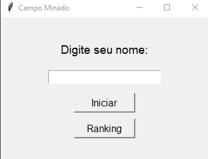
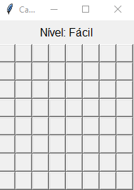
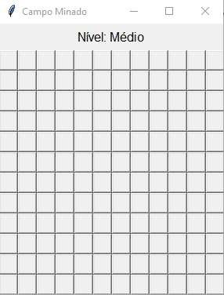
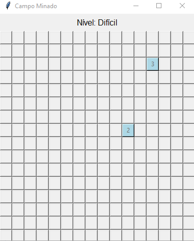
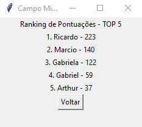

# Jogo de Campo Minado

Um jogo de Campo Minado desenvolvido em Python, utilizando a biblioteca Tkinter para a interface gráfica e JSON para armazenamento do ranking.

## Funcionalidades

- **Três níveis de dificuldade**: Fácil, Médio e Difícil, cada um com diferentes tamanhos de tabuleiro e número de bombas.
- **Sistema de Ranking**: Salva as pontuações dos jogadores em um arquivo JSON e exibe o ranking dos melhores jogadores.
- **Interface gráfica com Tkinter**: O jogo possui uma interface amigável, onde o usuário pode interagir com o tabuleiro e visualizar suas pontuações.

## Estrutura do Projeto

O jogo é estruturado em classes, cada uma responsável por uma funcionalidade específica:

- `BancoDeDados`: Gerencia o ranking dos jogadores, salvando e carregando pontuações.
- `Celula`: Representa cada célula do tabuleiro, com atributos para verificar se contém uma bomba, se já foi revelada e o número de bombas adjacentes.
- `Interface`: Cuida da interface gráfica com Tkinter, exibindo telas de identificação, tabuleiro do jogo e ranking.
- `Jogo`: Controla o fluxo do jogo, processando jogadas e níveis.
- `Tabuleiro`: Configura o tabuleiro, posiciona bombas aleatoriamente e define o número de bombas adjacentes para cada célula.
- `Usuario`: Controla o nome do jogador e sua pontuação.

## Fluxograma do Projeto

O fluxograma completo do projeto pode ser encontrado na pasta images/fluxograma.pdf ou pelo link: https://miro.com/app/board/uXjVLFjJ0do=/?share_link_id=750714267156

## Como Jogar

1. Digite seu nome na tela de identificação e clique em **Iniciar**.
2. Escolha uma célula no tabuleiro. Se a célula contiver uma bomba, você perde o nível e avança para o próximo, se disponível.
3. Caso revele todas as células sem bomba, você avança para o próximo nível.
4. A cada nível concluído, o tabuleiro aumenta de tamanho e a dificuldade é ajustada.
5. No final, sua pontuação é salva e você pode visualizá-la no ranking.

## Imagens da Interface

### Tela de Identificação


### Tela do Tabuleiro




### Ranking


## Executando o Projeto

### Pré-requisitos

- Python 3.x instalado.

### Instalação

1. Clone o repositório:
   ```bash
   git clone https://https://github.com/artryan130/CampoMinadoPOO

2. Navegue até o diretório do projeto:
   ```bash
   cd JogoCampoMinadoPOO

3. Execute o jogo:
   ```bash
   python main.py
